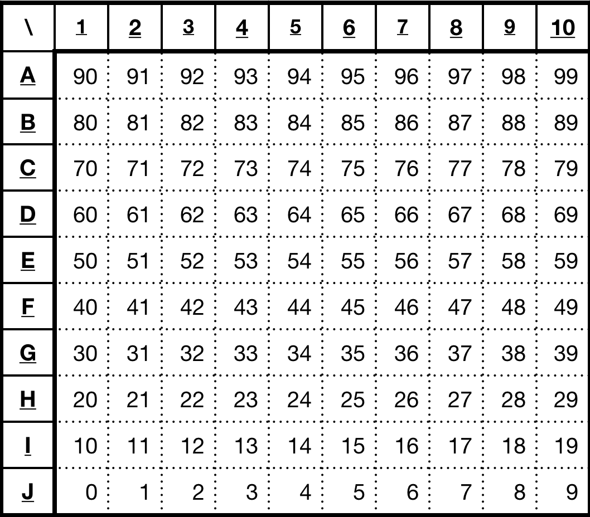
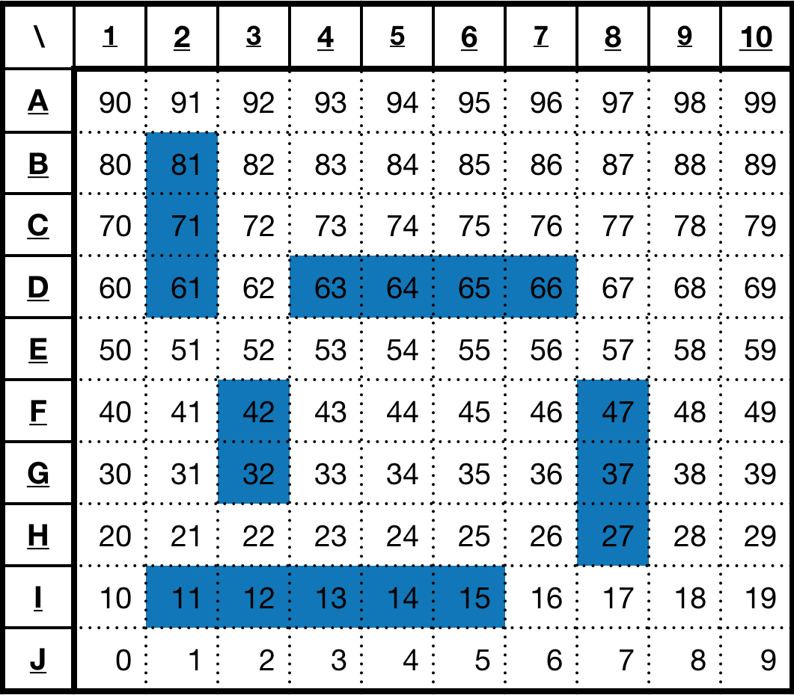

# battleship
battleship is a 100%-Javascript battleship game.

## Logic
The positions of a field are numbered consecutively from the bottom left corner to the top right corner as follows:<br />


## Preparation
Create an array of the positions of the ships:<br />

```javascript
let shipArray = [11, 12, 13, 14, 15, 27, 37, 47, 32, 42, 63, 64, 65, 66, 61, 71, 81];
```

## How it works:

### checkShipArray
```javascript
let shipArray = [11, 12, 13, 14, 15, 27, 37, 47, 32, 42, 63, 64, 65, 66, 61, 71, 81];
let f = new Field();
let res = f.checkShipArray(shipArray);
// res.status = "success"
```

### getShipsOfArray
```javascript
let shipArray = [11, 12, 13, 14, 15, 27, 37, 47, 32, 42, 63, 64, 65, 66, 61, 71, 81];
let f = new Field();
let res = f.getShipsOfArray(shipArray);
// res.shipArray = [ [ 27, 37, 47 ],[ 32, 42 ],[ 61, 71, 81 ],[ 11, 12, 13, 14, 15 ],[ 63, 64, 65, 66 ] ]
// res.shipArrayH = [ [ 11, 12, 13, 14, 15 ], [ 63, 64, 65, 66 ] ]
// res.shipArrayV = [ 27, 37, 47 ], [ 32, 42 ], [ 61, 71, 81 ]
```

### a whote match
```javascript
let s = new Battleship();

s.addPlayer("playerID1");
s.addPlayer("playerID2");

let ships = [ 0, 1, 2, 25, 26, 27, 28, 40, 47, 48, 50, 60, 72, 73, 74, 75, 76 ];
s.getPlayerById("playerID1").field.setShips(ships);

ships = [ 15, 16, 17, 40, 41, 42, 43, 44, 66, 69, 70, 71, 72, 76, 79, 86, 96 ];
s.getPlayerById("playerID2").field.setShips(ships);

s.startTheGame();
s.whoseTurn = "playerID1";

s.shoot("playerID1", 81); //fail
s.shoot("playerID2", 41); //fail
s.shoot("playerID1", 41); //hit
s.shoot("playerID1", 42); //hit
s.shoot("playerID1", 43); //hit
s.shoot("playerID1", 40); //hit
s.shoot("playerID1", 44); //hit //destroyed
s.shoot("playerID1", 61); //fail
s.shoot("playerID2", 73); //hit
s.shoot("playerID2", 72); //hit
s.shoot("playerID2", 71); //fail
s.shoot("playerID1", 0); //fail
s.shoot("playerID2", 74); //hit
s.shoot("playerID2", 75); //hit
s.shoot("playerID2", 76); //hit //destroyed
s.shoot("playerID2", 34); //fail
s.shoot("playerID1", 13); //fail
s.shoot("playerID2", 10); //fail
s.shoot("playerID1", 83); //fail
s.shoot("playerID2", 22); //fail
s.shoot("playerID1", 92); //fail
s.shoot("playerID2", 53); //fail
s.shoot("playerID1", 21); //fail
s.shoot("playerID2", 14); //fail
s.shoot("playerID1", 25); //fail
s.shoot("playerID2", 56); //fail
s.shoot("playerID1", 7); //fail
s.shoot("playerID2", 89); //fail
s.shoot("playerID1", 79); //hit
s.shoot("playerID1", 78); //fail
s.shoot("playerID2", 69); //fail
s.shoot("playerID1", 89); //fail
s.shoot("playerID2", 38); //fail
s.shoot("playerID1", 69); //hit //destroyed
s.shoot("playerID1", 33); //fail
s.shoot("playerID2", 95); //fail
s.shoot("playerID1", 64); //fail
s.shoot("playerID2", 26); //hit
s.shoot("playerID2", 25); //hit
s.shoot("playerID2", 24); //fail
s.shoot("playerID1", 76); //hit
s.shoot("playerID1", 75); //fail
s.shoot("playerID2", 27); //hit
s.shoot("playerID2", 28); //hit //destroyed
s.shoot("playerID2", 8); //fail
s.shoot("playerID1", 86); //hit
s.shoot("playerID1", 96); //hit
s.shoot("playerID1", 66); //hit //destroyed
s.shoot("playerID1", 38); //fail
s.shoot("playerID2", 91); //fail
s.shoot("playerID1", 62); //fail
s.shoot("playerID2", 2); //hit
s.shoot("playerID2", 1); //hit
s.shoot("playerID2", 0); //hit //destroyed
s.shoot("playerID2", 6); //fail
s.shoot("playerID1", 19); //fail
s.shoot("playerID2", 97); //fail
s.shoot("playerID1", 5); //fail
s.shoot("playerID2", 40); //hit
s.shoot("playerID2", 30); //fail
s.shoot("playerID1", 27); //fail
s.shoot("playerID2", 50); //hit
s.shoot("playerID2", 60); //hit //destroyed
s.shoot("playerID2", 93); //fail
s.shoot("playerID1", 98); //fail
s.shoot("playerID2", 58); //fail
s.shoot("playerID1", 70); //hit
s.shoot("playerID1", 71); //hit
s.shoot("playerID1", 72); //hit //destroyed
s.shoot("playerID1", 2); //fail
s.shoot("playerID2", 88); //fail
s.shoot("playerID1", 57); //fail
s.shoot("playerID2", 43); //fail
s.shoot("playerID1", 16); //hit
s.shoot("playerID1", 17); //hit
s.shoot("playerID1", 18); //fail
s.shoot("playerID2", 45); //fail
s.shoot("playerID1", 15); //hit //destroyed //gameover
```